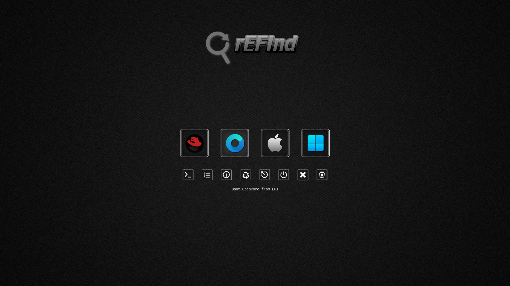

# rEFInd-Metal-Frame

- Icon Set use with [rEFInd](https://www.rodsbooks.com/refind/) and  [rEFIndPlus](https://github.com/dakanji/RefindPlus)
  
- ### 94 Distro Icons

View ➤ [Ison Set](https://github.com/chris1111/rEFInd-Metal-Frame/blob/main/View-Set.md)
View ➤ [All Icons](https://github.com/chris1111/rEFInd-Metal-Frame/tree/main/rEFInd-Metal-Frame)

Configuration ➤ [Refind config](https://github.com/chris1111/rEFInd-Metal-Frame/blob/main/rEFInd-Metal-Frame.conf)

Download Icons Set ➤ [rEFInd-Metal-Frame.zip](https://github.com/chris1111/rEFInd-Metal-Frame/raw/refs/heads/main/rEFInd-Metal-Frame.zip)

View Site ➤ [rEFInd-Metal-Frame](https://chris1111.github.io/rEFInd-Metal-Frame/)

### Screenshot

 
