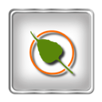
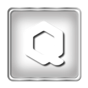
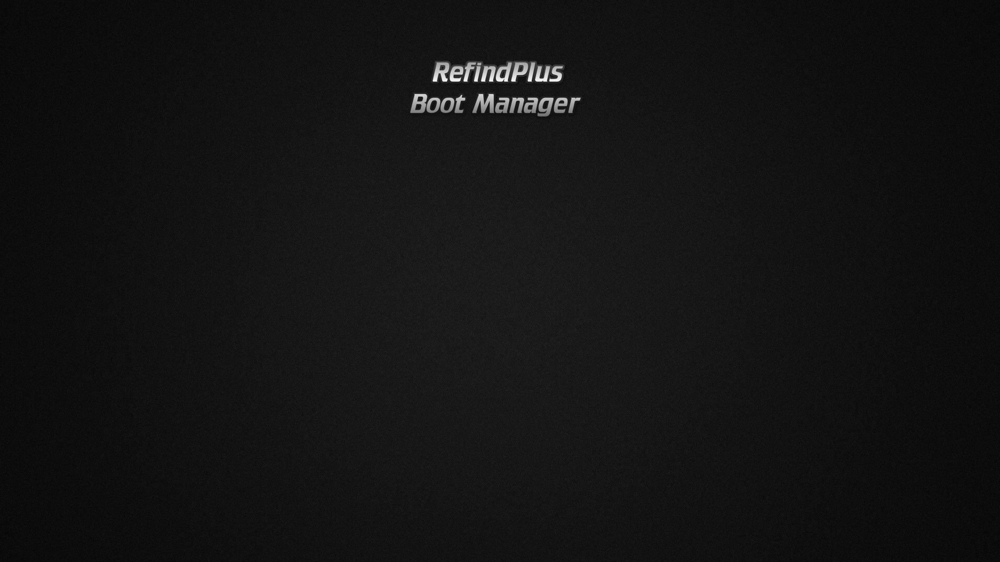

## View Set rEFInd-Metal-Frame






























































































### Banner

[Back On ➦ Top](https://github.com/chris1111/rEFInd-Metal-Frame/blob/main/View-Set.md#view-set)
